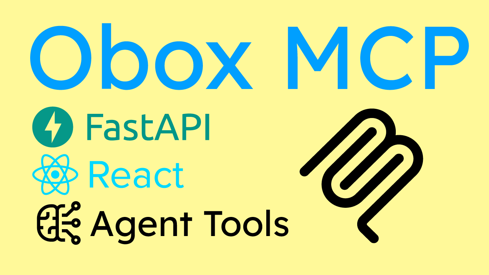

[](https://youtu.be/j_Gsx_FNj0o)

Click the image to watch the video tutorial.

# 🚀 Obox MCP: Project Setup & Integration

English | [Tiếng Việt](README.vi.md)

This guide explains how to install and integrate Obox MCP into your coding environment.

**Obox MCP** is a comprehensive development toolkit designed to supercharge your IDE. It provides:
- **Project Automation**: Manage dependencies and run tasks with `just`.
- **Language Tools**: Manage Node.js, Python, and .NET environments.
- **File System**: Advanced file search and navigation with `fd` and `ripgrep`.
- **System Utilities**: Cross-platform installers and shell integration.


---

## 🆚 Why Obox MCP?

### ❌ Without Obox MCP
LLMs are isolated execution environments. They cannot see your system or run code. You get:

- ❌ **Manual Execution**: The AI code suggests commands, but *you* have to switch to the terminal to run them.
- ❌ **Blind Guessing**: The AI hallucinates file paths or project structures it can't see.
- ❌ **Outdated Context**: You have to manually copy-paste file contents for the AI to understand your project.

### ✅ With Obox MCP
Obox MCP gives your AI agent **hands** and **eyes**. It can autonomously run commands, manage files, and navigate your project without you lifting a finger.

**Add `use obox` to your prompt:**

> "Find all Python files containing 'TODO' and list their locations."

> "Initialize a new FastAPI project, install dependencies, and run the server."

Obox MCP fetches real-time project info, executes complex build tasks, and manages your environment directly. No tab-switching, no manual copy-pasting, just results.

---

## 🛠 Prerequisites

Obox MCP is optimized to run using **Astral `uv`**. Ensure you have `uv` installed on your system:

```bash
# macOS / Linux
curl -LsSf https://astral.sh/uv/install.sh | sh
```

```powershell
# Windows (PowerShell)
powershell -c "Set-ExecutionPolicy RemoteSigned -Scope CurrentUser -Force"
powershell -c "irm https://astral.sh/uv/install.ps1 | iex"
```


---

## 🔌 Client Configuration

<details>
<summary><strong>Cursor</strong></summary>

[Cursor MCP docs](https://docs.cursor.com/context/model-context-protocol)

### Cursor Configuration

1. Go to: **Settings** -> **Cursor Settings** -> **General** -> **MCP** -> **Add new global MCP server**.
2. Paste the following configuration into your Cursor `~/.cursor/mcp.json` file.

```json
{
  "mcpServers": {
    "obox": {
      "command": "uv",
      "args": [
        "run",
        "--project",
        "/absolute/path/to/obox",
        "/absolute/path/to/obox/main.py"
      ]
    }
  }
}
```

</details>

<details>
<summary><strong>VS Code GitHub Copilot</strong></summary>

[VS Code MCP docs](https://code.visualstudio.com/docs/copilot/chat/mcp-servers)

### VS Code Configuration

1. Open Command Palette (`Ctrl+Shift+P` / `Cmd+Shift+P`).
2. Type: `MCP: Open User Configuration`.
3. Paste the content into the file.

```json
{
  "servers": {
    "obox": {
      "type": "stdio",
      "command": "uv",
      "args": [
        "run",
        "--project",
        "/absolute/path/to/obox",
        "/absolute/path/to/obox/main.py"
      ]
    }
  }
}
```


</details>

<details>
<summary><strong>Claude Code</strong></summary>

[Claude Code MCP docs](https://docs.anthropic.com/en/docs/claude-code/mcp)

### CLI Command

Run the following command in your terminal to add the MCP server:

```bash
claude mcp add obox -- uv run --project /absolute/path/to/obox /absolute/path/to/obox/main.py
```

### Manual Configuration (Claude Desktop)

Add this to your `claude_desktop_config.json`:

```json
{
  "mcpServers": {
    "obox": {
      "command": "uv",
      "args": [
        "run",
        "--project",
        "/absolute/path/to/obox",
        "/absolute/path/to/obox/main.py"
      ]
    }
  }
}
```

</details>

<details>
<summary><strong>Google Antigravity</strong></summary>

[Antigravity MCP docs](https://antigravity.google/docs/mcp)

### Antigravity Configuration

1. Open Command Palette (`Ctrl+Shift+P` / `Cmd+Shift+P`).
2. Type: `Antigravity: Manage MCP Servers`.
3. Click **View Raw Config**.
4. Paste the content into the file.

```json
{
  "mcpServers": {
    "obox": {
      "command": "uv",
      "args": [
        "run",
        "--project",
        "/absolute/path/to/obox",
        "/absolute/path/to/obox/main.py"
      ]
    }
  }
}
```

</details>

---

## 💡 Important Tips

### Add a Rule

To avoid typing `use obox` in every prompt, add a rule to your MCP client to automatically invoke Obox tools for development tasks.

**Recommendation:** Copy the content of [.github/copilot-instructions.md](.github/copilot-instructions.md) into:

- **Cursor**: `Cursor Settings` > `Rules`
- **Claude Code**: `CLAUDE.md`
- **Other Clients**: The equivalent system prompt or rules setting.
